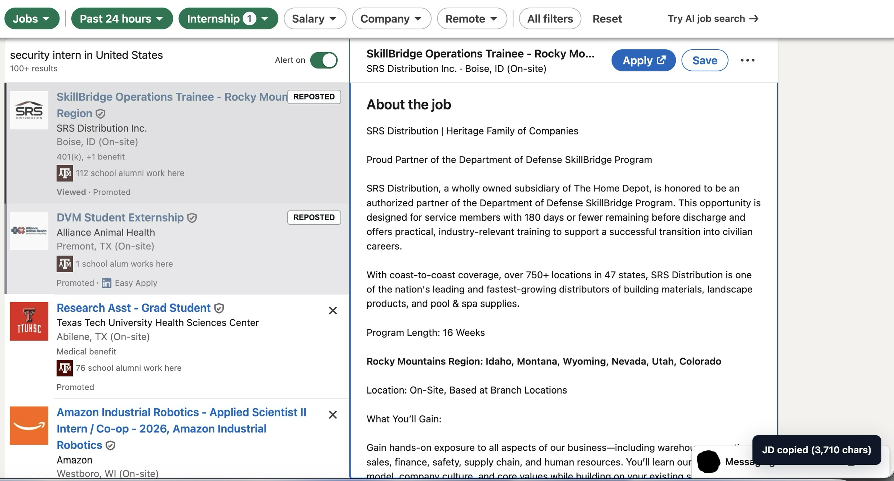

# LinkedIn Job Helper

A Chrome extension for LinkedIn Jobs that helps job seekers highlight reposted jobs, copy job descriptions with a shortcut, and streamline their job search workflow.

## Demo

## Features

- **See reposted jobs before you click**: Highlights reposted LinkedIn job postings directly in your search results. No need to open each listing to find out.
- **Zero extra requests**: Reads repost status from LinkedIn's own search traffic as you browse — no extra page visits, no rate-limit risk.
- **One-shortcut JD copy**: Copy the full job description of whatever posting you have open with a customizable keyboard shortcut.
- **Built for resume tailoring**: Paste straight into your job tracker or resume-tailoring workflow, no manual selecting and copying.

## How to install

1. Clone or download this repository first
2. Open Chrome and go to `chrome://extensions`.
3. Turn on **Developer mode**.
4. Click **Load unpacked**.
5. Select the `linkedin-job-helper` folder.
6. Done!

## How to change the keyboard shortcut

Chrome lets each user choose their own shortcut.

1. Open `chrome://extensions/shortcuts`.
2. Find **LinkedIn Job Helper**.
3. Set the shortcut for **Copy the current LinkedIn job description**.

The suggested default is `Alt+Shift+J`.

## Want a new feature?

Scope is intentionally kept to **LinkedIn Jobs** for now. Got an idea? Open an issue with what you're trying to do and I'll take a look.
